# Short `moovweb-automation` framework documentation

## How to setup test framework ?

**Preconditions:**

*Before start make sure that you have [TrueAutomation.io](www.trueautomation.io) account*

1. Clone project: `git clone https://github.com/moovweb-projects/mw-automation-framework.git`
2. Get invite to the Moovweb account in trueautomation.io (ping Denys Shutko for this)
3. You must have installed [client](https://trueautomation.io/docs#/README)
4. You must initialized this [project with trueautomation](https://trueautomation.io/docs#/getting-started/project-setup)
    
    3.1. Run `trueautomation init` command in project `root` and flow the steps. After this in you project root created file with name `trueautomation.json`
4. Add `Element Picker` extension in your Chrome Browser for adding new objects into object repository, after you can use this objects in your tests.

(NOTE: We will use trueautomation.io Artificial Intelligence elements search and element picker in future test framework versions, currently it is in test-flight mode)

5. Install allure reporter `brew install allure`

## How to run tests ?

Do this only first time:

`gem install bundler` - install bundler gem

`bundle install` - downloads ruby gem 

### Locally

You have 2 ways to run tests. With `default` parameters and you can set test environment into `ENV` var.

1. default

`cucumber` - Run all test-cases on default environment. Now default site is `venus-dev`.

`cucumber features/regression/vn` Run all venus-cases on default environment.

**OR YOU CAN RUN SPECIAL RUN FILE** (*allure report generated & opened automatically*)

`bash run.sh` - TBD

2. ENV

`cucumber ENV=venus-prod` Run all test-cases on venus production environment.

`cucumber features/regression/vn -base_url='https://venus.com'` Run all venus-cases on venus production environment.

`cucumber features/regression/vn -base_url='https://stage.venus.com'` Run all venus-cases on venus stage environment.

3. CHANGE env.rb FILE

Go to `features/support/env.rb` file and change default env line by commenting/uncommenting lines:

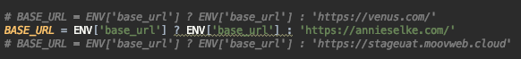

Then depends on default BASE_URL run cucumber test feature/features from site directory

`cucumber features/regression/an/happy_path.feature` Single feature

`cucumber features/regression/an` All features in directory

### CI
1. Open Jenkins 
2. Open Job with name `venus-prod` or `venus-dev` ... 
3. Click Run button

TBD...

## How to generate Allure report 

`allure serve gen/allure-results/` - run this command in terminal from project root dir after test finished(Browser window with report will be opened). 

Example report: 
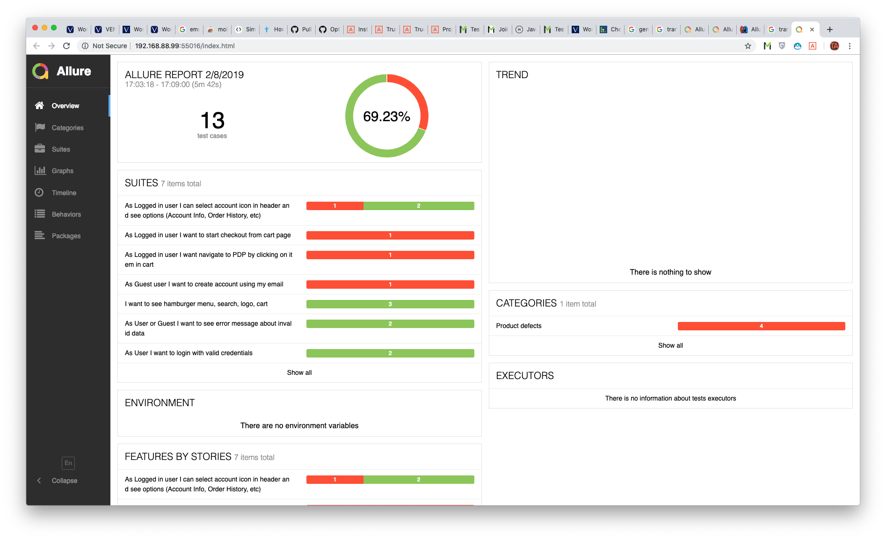 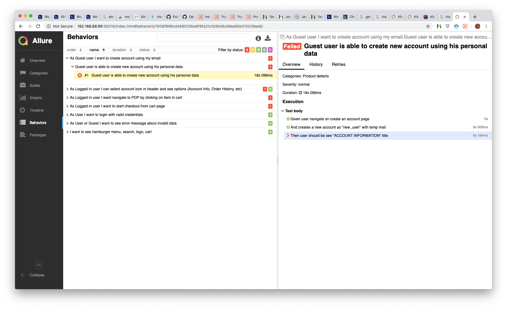 

## How to create tests ?

### Project structure 

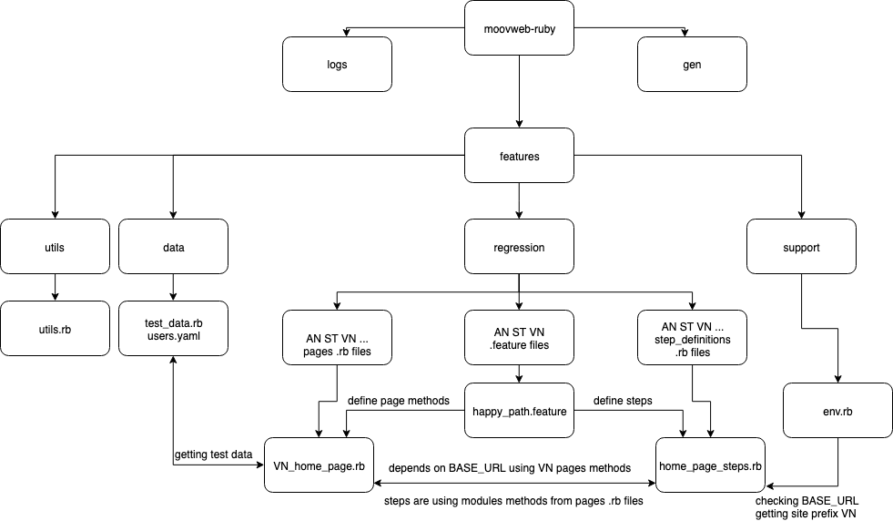 

* *moovweb-ruby* - root of a project. Contains features folder and some utils files (e.g. `Gemfile` with gem; `.gitignore`, `README.MD` and so on)
* *data* - contains env data for tests. Like sites `urls`, `site-id`, `site-name`, User info (first name, last name, email ... )
* *logs* - contains `web-drive/trueautomation` log files.
* *gen* - contains allure report data.
* *support* - Contains `env.rb` file. File contains settings for web-driver and startup parameters.
* *utilities* - Contains `utils.rb` file. File utilities for framework.
* *step_definitions* - Contains .rb files with tests steps and test logic's.
* *regression* - Contains folders with `.features` files.
* *pages* - Contains site folders with `.rb` files with pages methods.

=======================DATA===================

/features/data
Files in this folder are using to collect test data using in test scenarios
Users.yaml - users data, passwords, emails etc…
test_data.rb - test data like searching queries array, categories for sites, other

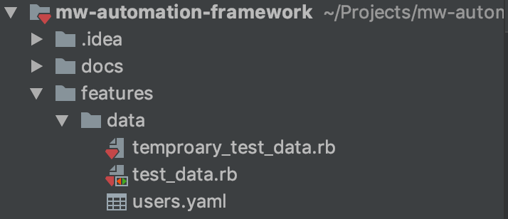

======================PAGES===================

/features/pages/AN

/features/pages/ST

/features/pages/VN

/features/pages/test_site_prefix

	•	There are ruby modules (classes in Java) for each site page(like in page object pattern). 
Every module file should be named in such stile:

VN_home_page.rb (<<<please set file names in correct style)

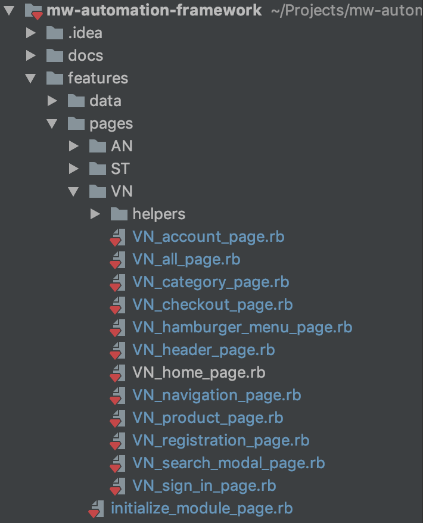

	•	Every module should be named in such style : VN_HomePage
module VN_HomePage

*module body*

end

	•	Each module contains methods corresponding to the page module created for:
module VN_HomePage (<<<please set module names in correct style)

def self.visit_home_page (<<<please set methods names in correct style)

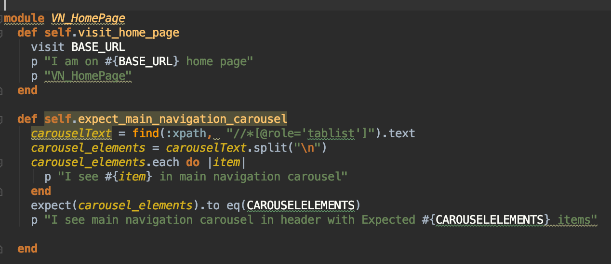

All module files should be extended with:

		extend Capybara::DSL
		extend RSpec::Matchers
	
======================FEATURES================

/features/regression/ST

/features/regression/VN

/features/regression/AN

/features/regression/<test site prefix>

Contains folders with .features files for each corresponding site.

 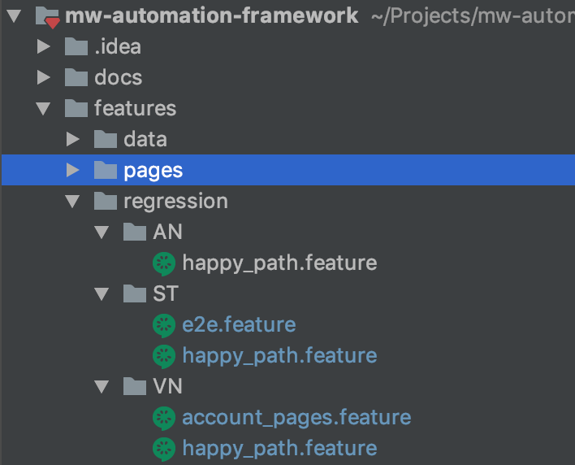
 
 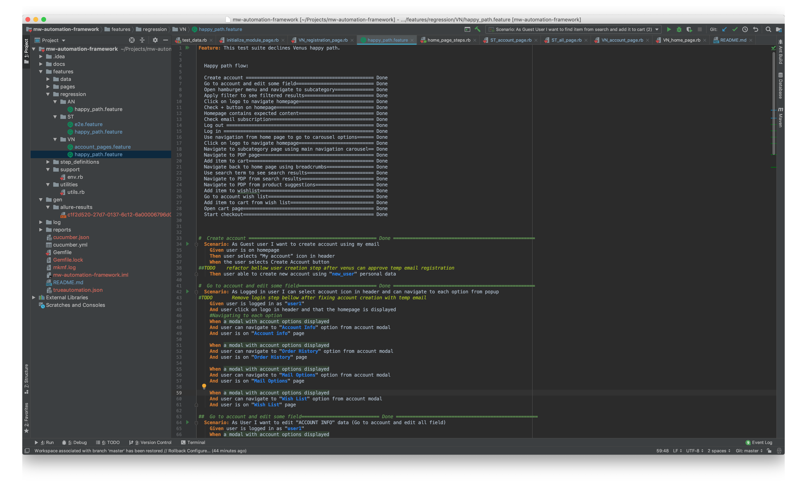

======================STEPS=================

/features/step_definitions/

This folder contains .rb files with declaration of test steps.
Each step defining usage of special methods depends on starting base URL.

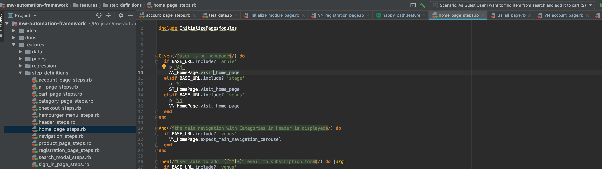

## Create your first test 

### Instruction:
* Firstly create a file structure for your test site
* Prepare feature files
* Prepare step definition for features
* Prepare pages definitions with methods
* Don't forget about naming
* Don't forget about BASE_URL in env.rb file
* Use only wright methods in your step definitions (use inheritance like `MY_SITE_AccountPage.expect_homepage_page`)
* Ask someone in team to help you if have a problem

1) Create folder with .feature file in `/features/regression/{...SITE_PREFIX...}` 
   `/features/regression/MY_SITE/happy_path.feature` for example
   
   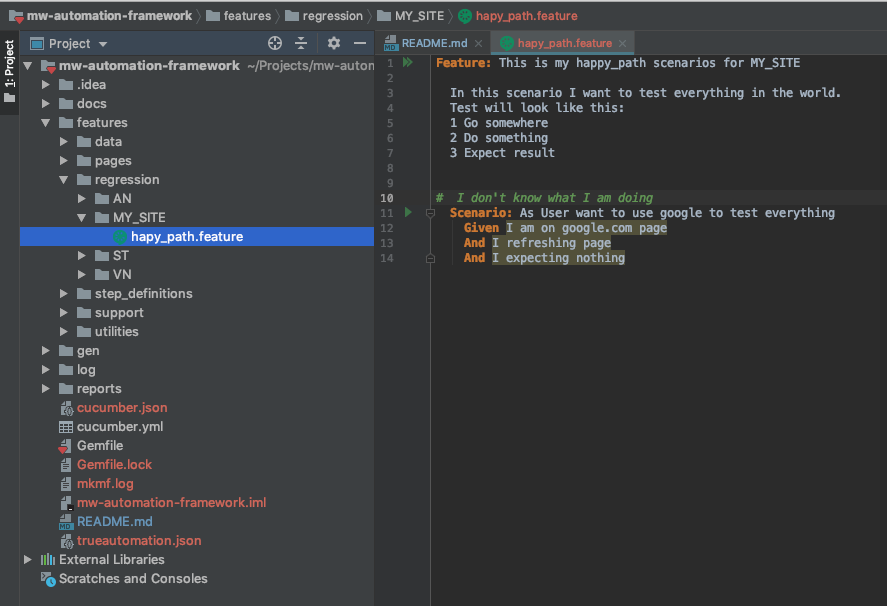

   
2) Create step definitions file for your tests in folder with step_definitions. 
Define your steps in that file

    `/features/step_definitions/my_test_steps.rb` for example  
      
      
3) Create module for your testing page with methods for this page

    `/features/pages/MY_SITE/MY_SITE_home_page.rb` for example  
    
   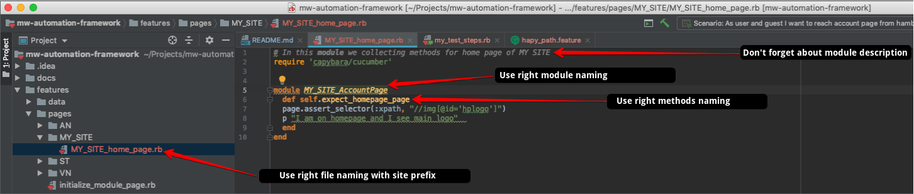 
   
   Don't forget to extend module with:
   
   		extend Capybara::DSL
   		extend RSpec::Matchers
   
4) Start using page methods in your step_definition files:

    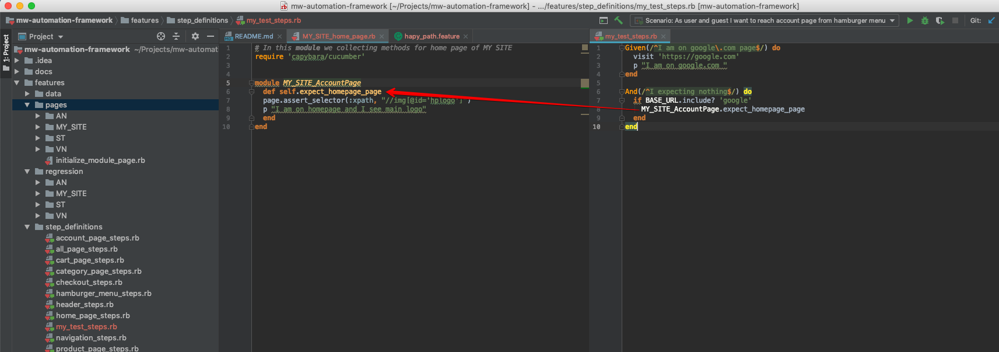 
    
      

### Running:
* Run this in terminal:

`cucumber features/regression/MY_SITE/happy_path.feature -base_url='https://google.com`

### Congrats! You are a test automation engineer!

## BDD guideline 

When you creating test steps using moovweb-testautomatio-framework please try to follow this guide.

There are number of common test steps for every site:
- Actions with webelement:
    - Click
    - Fill 
    - Set
    - Unset
    - Select
- Checks:
    - Can see
- Navigations:
    - User is on <page>

###Actions

**Base pattern for Click:**

There are two types of web elements we are working with. Unique elements like «logo_button», «cart_icon», «checkout_button» and NOT unique elements, elements from list like  "dresses_subcategory» from subcategories list, «lingerie» from main navigation carousel.

	[user][click][web_element_name]on[page_name or component_name]

Examples:

In case you want to create click step for unique web_element, use this pattern:
`When user click cart_icon on header`

`Then user click view_bag on popup`

`And user click logo_button on header`

In case you want to create click step for one of elements from component with list of same elements (main_navigation_carousel, hamburger_menu, footer_links, shop_now buttons on home_page) use this pattern:
`When user click «clothing" on main_navigation_carousel`

`When user click «lingerie» on main_navigation_carousel`

`When user click «what’s new» on main_navigation_carousel`

`And user click "clothing_category" on hamburger_menu`

`And user click "dresses_subcategory" on hamburger_menu`

`When user click "venus_card" on hamburger_menu`

**Base pattern to work with fields:**

There are two type of actions with text fields. When you just typing some value in field and NOT saving, and when you typing  some value into field and make action to save the value (action like click «save_button» or switch to another field).

	[user][set][web_element_name, field_name][with value][«value»]on[page_name or component_name]
	[user][fill][web_element_name, field_name][with value][«value»]on[page_name or component_name]

Examples:

`And user set offer_code field	with value "incorrect_offer_code" on cart_page `

`And user fill offer_code field	with value "correct_offer_code" on cart_page`

**Base patterns for radio buttons, and dropdown:**

	[user][select][web_element_name]from[dropdown_name]on[page_name or component_name]
	[user][select][web_element_name]from[radio_button_list_name]on[page_name or component_name]

Examples:

`And user select «random_subcategory» from subcategory_filter on category_page`

`And user select «s_size» from size_dropdown on product_page`

`And  user select «private» from keep_your_wishlist_radio on wishlist_account_page`

**Base patterns for checkbox:**

Two types of action with checkboxes - set and unset, and the pattern looks like click pattern:

`[user][set][web_element_name]on[page_name or component_name]`

`[user][unset][web_element_name]on[page_name or component_name]`

Examples:

`And user set «don’t_show_this_message_again» on get_shipping_updates_popup`

`And user unset «don’t_show_this_message_again» on get_shipping_updates_popup`

###Checks

There are number of checks for elements on pages.
* You are checking all of elements are present on the page
* You are checking one element is present on the page
* You are checking one of elements has expected value

    `[user][can see][web_element_name]on[page_name or component_name]`

    `[user][can see][web_element_name] with value [«value»]on[page_name or component_name]`

Examples for checking ALL of elements on the page we are using this construction in tests <component_name>_content (hamburger_content , home_page_content) :

`And user can see "hamburger_content" on hamburger_menu`

`And user can see "home_page_content" on home_page`

Example to check one of element:

Then user can see "dresses_subcategory" on hamburger_menu
`And user can see "product_size" on cart_page`

`And user can see "product_color" on cart_page`

`And user can see "product_price" on cart_page`

Example to check one of element with value:

`And user can see "product_size" with value «s» on cart_page`

`And user can see "product_color" with value «blue» on cart_page`

`And user can see "product_price" with value «19.99» on cart_page`

###Navigations

If you want to use navigation by link in your tests (mostly in Given steps), use this pattern:

	[user][is on][page_name]

`Given user is on home_page`

`Given user is on cart_page`

Don’t forget this test step should go by url link and should check if one or couple main elements are on the page, just to be sure that navigation through the link was done.

###General recommendations 

Try to use patterns from this document in ALL your tests. Here is helping constructor https://docs.google.com/spreadsheets/d/1OyoS4XvBURbGTI14-nk6oVey9Z-ivjCaogEEHNkZgZ4/edit#gid=0

In case of patterns are not working for your test step (there will be some unique tests of course), try to follow this rules:

* One test = one action and one check.

* If test contain «and» word it is two tests.

* Every test should have acceptance check inside, you should be sure that action in test were completely done.

* All web elements name, pages names should be downcase with underline instead spaces:

`home Page - WRONG `

`home_page - RIGHT`

When you creating a test steps please try NOT to use words like «in» «there» «and» «where» and other. The only helping words are:
- on (on home_page, on hamburger_menu)
- with value (with value «small», with value «blue», with value «12.88»)
- from (from size_dropdown, from home_delivery_radio)

###EXAMPLES OF WRONG TEST STEPS:

`Then user open size filter`

`And user selects random filter option`

`And user press 'View Results' button on filter pop up`

`And user selects two random filter options`

`And user clears filter selection`

`And user can see all items in subcategory`

`And user click "random_item_image" on category_page`

`And the main navigation with Categories in Header is displayed`

### Please, notice difference between "user is on (page name)" and "user can see..."

- "user is on (page name)" means that user navigates directly to expected page
- "user can see..." means that user checks that he is on expected page

Examples(venus.com):
`user is on home_page` - user navigates to venus.com

`user can see "home_page_content" on home_page` - user checks that he was navigated to home page

command for run tests with
cucumber features/regression/VN/VnAccountPages.feature --retry 1 screenshot_on_fail=true ta_enabled=true --tag "@test"

